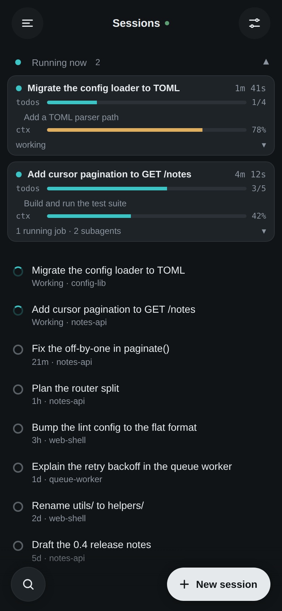
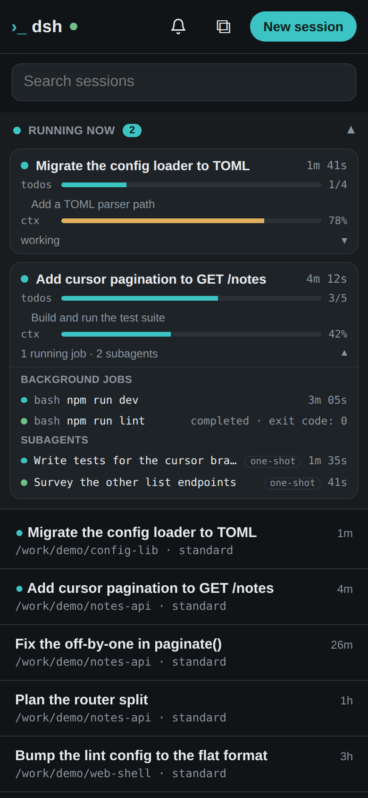
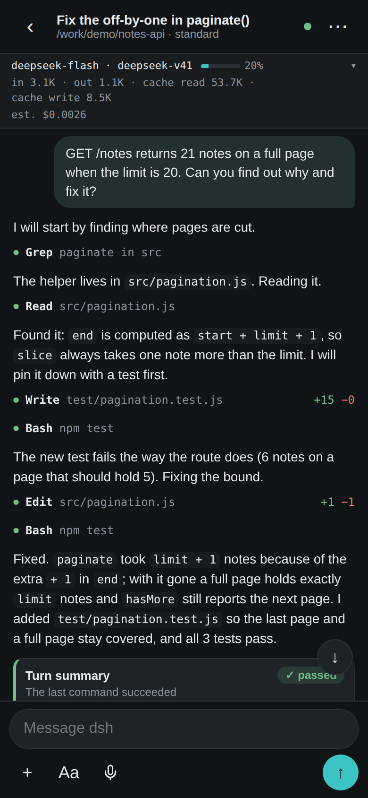
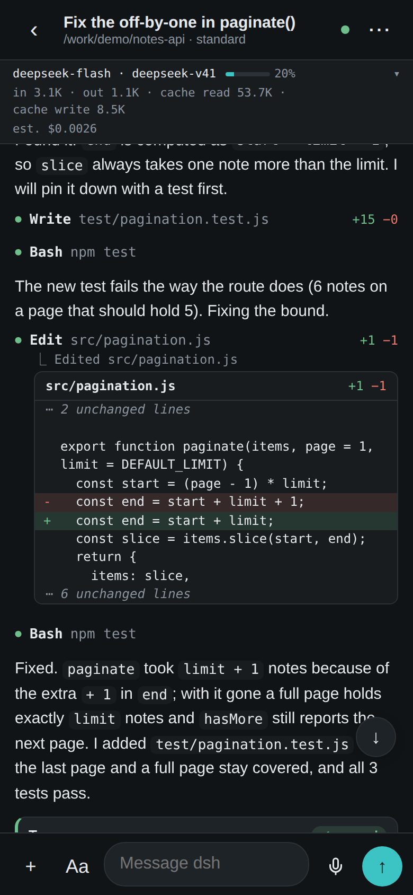
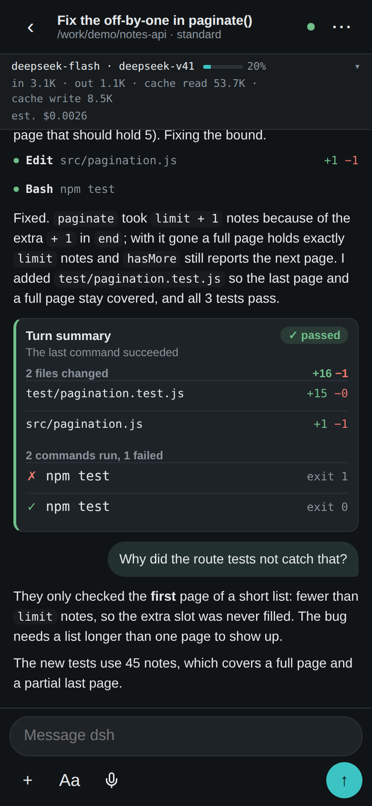
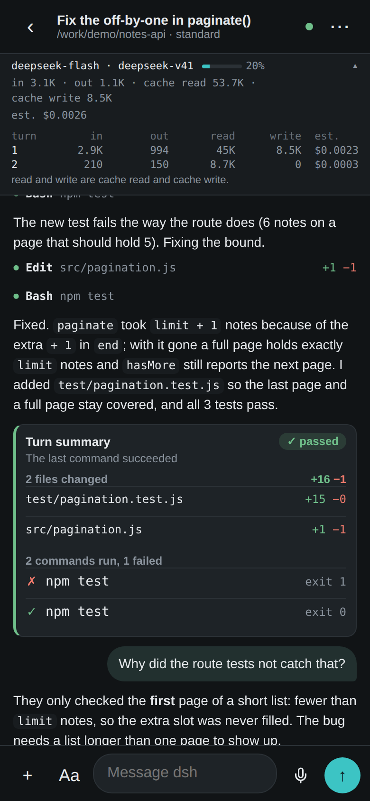
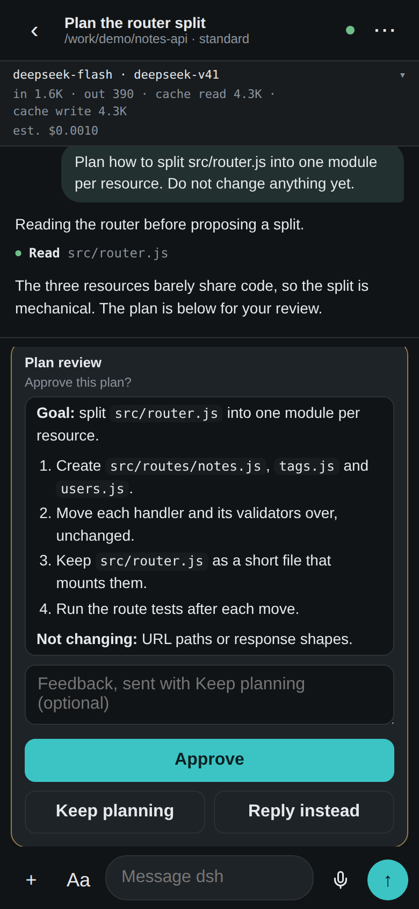
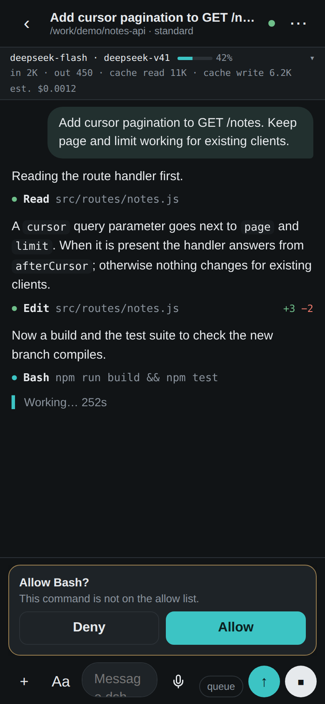

# dsh-rc

A phone-first remote control for a running `dsh web` server (compatible with DeepSeek Harness).
Independent project, not affiliated with or endorsed by DeepSeek.

Session list, chat with streaming replies, compact tool rows you tap to expand (file edits open
as line diffs), a summary card at the end of each turn (files changed, commands run, passed or
failed), approval and question cards above the composer, plan-mode plans as approve / keep
planning cards, stop / steer / queue, slash commands, model switching,
fork, export and archive from the session menu, image attachments, dictation through the browser's
Web Speech API where it exists, a read-only plugins and connectors screen, a per-session status line
(model and route, context fill, session tokens, estimated cost), a Running now dashboard for
every active session, and Web Push notifications for approvals, questions, finished turns and
errors.

No build step. `public/` is plain HTML, CSS and JS; `server/` is plain Node ESM (Node 22 or newer). Markdown uses
marked and DOMPurify, vendored in `public/vendor/` (their license headers are kept in the files).

## Screenshots

Made from the demo sessions described under "Regenerating the screenshots", never from a real
dsh. Every project, path and conversation in them is invented.

| | | | |
|:-:|:-:|:-:|:-:|
|  |  |  |  |
| Session list | Running now, one card open | Chat with tool rows | Edit as a line diff |
|  |  |  |  |
| Turn summary | Status line, per-turn breakdown | Plan review | Approval while a turn runs |

## Setup

```
npm install
npm start
```

`npm install` pulls the single runtime dependency (`web-push`). `npm start` runs
`node server/index.mjs`. `npm test` runs the Node test runner (`node --test`).

## How it is served

dsh refuses API calls from any other origin, so this page must share the origin of dsh web.
Either mount both on one name with Tailscale Serve, as here, or let dsh-rc's own proxy be the
front door (see "Access beyond Tailscale" below). With Tailscale Serve, mount the page at `/m`
beside dsh on port 443:

```
https://<machine>.<tailnet>.ts.net/    -> 127.0.0.1:3080  (dsh web)
https://<machine>.<tailnet>.ts.net/m/  -> 127.0.0.1:3081  (this page, node server/index.mjs)
```

1. Start dsh so it trusts your tailnet name:
   `dsh --profile <profile> --no-open --trusted-host <machine>.<tailnet>.ts.net`
2. Serve the page on loopback: `npm start` (or `node server/index.mjs`). It listens on
   127.0.0.1:3081 by default, and refuses any other bind address unless a passphrase is
   configured (see "Access beyond Tailscale" below). Override the port with `DSH_RC_PORT`.
3. Mount both on your tailnet name:
   `tailscale serve --bg 3080` (dsh web at `/`), then
   `tailscale serve --bg --set-path /m http://127.0.0.1:3081` (this page at `/m`)
4. Open `https://<machine>.<tailnet>.ts.net/m/` on your phone. Add it to the home screen for full screen.

`examples/` has user systemd units for both processes.

## Access beyond Tailscale

The server can also be the whole front door by itself. It serves the page and proxies `/api`
and the two event sockets to `$DSH_URL`, so nothing has to share dsh's origin through path
mounting. dsh itself stays on loopback in every setup below.

**Once, for every standalone setup: let dsh trust the proxy.** dsh answers 403 to any Host it
does not trust, and it keeps settings, credentials and a few host actions for loopback Hosts
only. The proxy therefore presents its own name, `dsh-rc.internal`, rather than pretending to be
loopback, and dsh must be told to trust it:

```
dsh --profile <profile> --no-open --trusted-host dsh-rc.internal
```

(`--trusted-host` repeats, so keep your tailnet name as well if you use both.) Change the name
with `--upstream-host` / `DSH_RC_UPSTREAM_HOST`; a loopback name is refused. The proxy also
refuses the settings and credentials methods itself. If dsh answers 403 anyway, the server log
says which flag is missing.

**A passphrase is required whenever anything beyond this machine can reach the server**: a
non-loopback `--host`, or `--tunnel` (cloudflared connects from loopback, so the bind address
alone would not catch it). Without one the server refuses to start. Set it once with

```
node server/index.mjs --set-passphrase
```

which prompts (without echo), stores a scrypt hash in the state dir and signs out every existing
login. `DSH_RC_PASSPHRASE` works too, but leaves the plaintext in the environment. Passphrases
shorter than 12 characters are refused. A configured passphrase also turns the login on for a
loopback-only server.

With no passphrase, a loopback server keeps working as before, but its proxy only answers
requests whose Host is loopback (`127.0.0.1`, `localhost`, `[::1]`) or listed with
`--trusted-host` / `DSH_RC_TRUSTED_HOSTS`. A reverse proxy or tunnel pointed at it by mistake
forwards its public Host and gets 403, and so does a DNS-rebinding web page. Only list names on a
private network there.

### Plain LAN

```
node server/index.mjs --host 0.0.0.0
```

Open `http://<lan-address>:3081/` from a device on the same network. This is plain HTTP, so
anyone on the network can read the passphrase and session cookie in transit, and Web Push is
unavailable (browsers require HTTPS). Use it on a network you trust, or add HTTPS below.

### Cloudflare quick tunnel

```
node server/index.mjs --tunnel
```

This spawns `cloudflared tunnel --no-autoupdate --url http://127.0.0.1:3081` and prints the
`https://<random>.trycloudflare.com` URL it gets. cloudflared must already be on `PATH`; dsh-rc
never downloads it, and `--no-autoupdate` stops cloudflared updating itself. Install it from
[Cloudflare's downloads page](https://developers.cloudflare.com/cloudflare-one/connections/connect-networks/downloads/).

A quick tunnel has no access control of its own, so the passphrase is the only thing between
anyone who learns the URL and a shell as you. Pick a long one. The URL changes on every start,
so it is not something to bookmark or add to a home screen. The URL is also printed as a QR code
in the terminal, and the session list menu has an "Open on your phone" item that shows the same
code, so a phone can scan it instead of typing the address. The code holds only the URL; the phone still has to log in.
The encoder is a small one in `public/qr.js`, with no dependency.

### Named Cloudflare tunnel with Access (the durable setup)

Create a named tunnel on a domain you control and run it yourself, outside dsh-rc, pointed at
`http://127.0.0.1:3081`. Put the hostname behind a
[Cloudflare Access](https://developers.cloudflare.com/cloudflare-one/policies/access/) policy
that admits only you, so strangers never reach the page. Start dsh-rc with a passphrase anyway;
it is a second lock, and the no-passphrase Host check would refuse the tunnel's hostname.

### ZeroTier, NetBird or WireGuard

These put the machine on a private network as Tailscale does, but without Serve in front. Bind
dsh-rc to the machine's address on that network with a passphrase, and open
`http://<vpn-address>:3081/`:

```
node server/index.mjs --host <vpn-address>
```

Traffic is encrypted by the VPN, but the browser still sees plain HTTP, so Web Push needs HTTPS
as below.

### HTTPS

- **Your own certificate.** `--cert <file> --key <file>` (or `DSH_RC_CERT`, `DSH_RC_KEY`) serves
  everything over HTTPS directly, and marks the session cookie `Secure`. Both are required.
- **Behind Caddy** (or another reverse proxy). Keep dsh-rc on loopback with a passphrase and let
  Caddy terminate TLS, for example `<name> { reverse_proxy 127.0.0.1:3081 }`. Caddy's automatic
  certificates need a real domain name pointing at the machine. Caddy passes the browser's Host
  through, which the Origin check expects.

**Never expose dsh itself** (port 3080), whether through a tunnel, a LAN bind or a reverse proxy.
It has no authentication, and dsh-rc exists so that it never has to.

## Notifications

The server also watches dsh's event feeds (dsh 0.1: `/api/events.mux` and `/api/events.host`;
dsh 0.2: one `/api/remote.mux` socket; read-only, with capped reconnect backoff) and sends a Web Push notification with VAPID when:

- an approval is requested (title "Approval needed", with the tool name and reason),
- a question is waiting (title "Question waiting"),
- a turn finishes (title "Turn finished"),
- an agent or stream error arrives (title "Error", with the message).

Subagent sessions are ignored, the session title is included when known, repeats with the same
tag are debounced for 5 seconds, and subscriptions that answer 404 or 410 are removed. Tapping a
notification focuses an open dsh-rc window and opens that session, or opens `./index.html#s=<id>`.

In the app, open a session, tap ⋯ and pick **Notifications**. Turning on must happen from that tap
(browsers, iOS especially, only grant the permission from a user gesture). The sheet shows the
state (on / off / unsupported), and offers **Send test**, which notifies every subscribed device.

iOS notes: notifications only work in a web app added to the Home Screen (Share, then Add to
Home Screen), on iOS 16.4 or newer. The origin must be HTTPS, which the Tailscale Serve mount
already provides. In a plain Safari tab, add it to the Home Screen first and open it from there.

State lives outside the repo, in `$DSH_RC_STATE_DIR` (default `$XDG_STATE_HOME/dsh-rc`, falling
back to `~/.local/state/dsh-rc`). `vapid.json` (generated on first run) and `subscriptions.json`
are written as 0600 files in a 0700 directory.

Environment variables:

| Variable | Default | Meaning |
| --- | --- | --- |
| `DSH_RC_PORT` | `3081` | Port for the page, push API and proxy |
| `DSH_RC_HOST` | `127.0.0.1` | Bind address; anything but loopback needs a passphrase |
| `DSH_RC_STATE_DIR` | `$XDG_STATE_HOME/dsh-rc` or `~/.local/state/dsh-rc` | Where `vapid.json`, `subscriptions.json`, `passphrase.json` and `session-secret` live |
| `DSH_RC_VAPID_SUBJECT` | `https://github.com/Matthew3957/dsh-rc` (Apple rejects `localhost` mailto subjects; use your own `mailto:` or `https:` URL) | VAPID subject sent with each push |
| `DSH_URL` | `http://127.0.0.1:3080` | dsh web base URL: its event sockets are watched and `/api` is proxied to it |
| `DSH_TOKEN` | none | dsh 0.1.7 and later only: the launch token dsh printed at start (or the whole `?token=` URL) |
| `DSH_TOKEN_FILE` | none | dsh 0.1.7 and later only: a file holding that token, read again on every exchange |
| `DSH_RC_UPSTREAM_HOST` | `dsh-rc.internal` | Host the proxy presents to dsh; start dsh with `--trusted-host` for it |
| `DSH_RC_TRUSTED_HOSTS` | none | Comma-separated extra Host names the proxy accepts when there is no passphrase |
| `DSH_RC_PASSPHRASE` | none | Login passphrase, 12 characters or more (hashed in memory; `--set-passphrase` avoids keeping the plaintext around) |
| `DSH_RC_TUNNEL` | off | `1` or `true` starts a Cloudflare quick tunnel; requires a passphrase |
| `DSH_RC_CERT`, `DSH_RC_KEY` | none | Certificate and key files to serve HTTPS directly |

Flags: `--host`, `--port`, `--dsh-url`, `--upstream-host`, `--trusted-host` (repeatable),
`--dsh-token-file`, `--tunnel`, `--cert`, `--key`, and `--set-passphrase`, which stores a hashed passphrase (from
`DSH_RC_PASSPHRASE`, or a prompt) and exits. Flags win over environment variables. `--help`
lists them.

Push API (same origin, under `/m/`): `GET ./push/key`, `POST ./push/subscribe`,
`POST ./push/unsubscribe`, `POST ./push/test`. JSON bodies are capped at 16 KB and at most 20
subscriptions are stored; endpoints must be HTTPS.

## Security

dsh has no authentication. Anyone who can reach it can run commands as your user. Keep dsh itself
on loopback, or tailnet-only through Tailscale Serve (not Funnel), and never point a tunnel, a LAN
bind or a reverse proxy at it directly. dsh blocks settings and credential changes from
non-loopback hosts. This page does not edit settings or credentials, but it can do anything a
dsh session can: send prompts, run slash commands, approve tools, switch models, rename, fork
and export sessions, and archive them (which dsh cannot undo).

When dsh-rc is the front door, it adds:

- **A passphrase login**, required for any non-loopback bind and for `--tunnel`, optional on a
  loopback-only server. Sessions are HMAC-signed cookies (HttpOnly, SameSite=Strict, `Secure`
  over HTTPS or a tunnel) that last 30 days; `--set-passphrase` revokes all of them. The
  passphrase is stored as a scrypt hash. Login attempts are limited to 10 a minute across all
  clients, since behind a tunnel every client looks like loopback. Without a session, only the
  login page, the manifest and the icons are served.
- **An Origin check** on every write and every event socket: a request whose Origin does not
  match its Host is refused, as is `Sec-Fetch-Site: cross-site`. Other web pages cannot drive
  dsh through the proxy.
- **A Host check without a passphrase**: the proxy only answers loopback or `--trusted-host`
  names (see above).
- **No privileged Host.** The proxy presents `dsh-rc.internal`, never a loopback name, so dsh's
  loopback-only settings and credentials methods stay out of reach. The proxy refuses them as
  well, and drops its own session cookie before forwarding.

With the Tailscale Serve mount described above, `/api` goes straight to dsh and none of this
applies to it; the tailnet is the boundary there.

## Protocol notes

- RPC: `POST /api/<method>` with `{type:"client-request", rpcId, method, payload}`.
  Typert methods such as `commands/execute` take `payload: {args: {...}}`.
- Events: WebSockets `/api/events.mux` (all sessions) and `/api/events.host` (status). Receive only.
- Approvals and questions are answered with `POST /api/respond` (a client-response).
- Slash commands go through `commands/execute`, not `session.prompt`.
- Typing `@` in the composer lists files and folders of the session's working directory
  (`fileReferences/list`, payload `args: {agentId, query}`) and inserts the path, `@"..."` when it
  has spaces. Tapping a folder keeps the list open one level down.
- The above is the older dsh API (0.1.6 and earlier). The newer one, from 0.1.7 on ("dsh 0.2" below), differs on every point (namespaced methods, one `/api/remote.mux`
  socket, a cookie); `public/dsh02.js` maps it onto the same shapes. See Compatibility below.

## Compatibility

| dsh | Status |
| --- | --- |
| 0.1.1-rc.2 | Supported (older API), what everything here was first built against. |
| 0.1.7-rc.2 | Supported (newer API, same as 0.2): the 0.1 line switched protocols at 0.1.7. |
| 0.2.0-rc.2 | Supported for the core (npm's `latest` tag at the time of writing): session list, chat streaming, prompts, approvals, questions, queue, stop, model, rename, fork, archive, new session, slash commands, push notifications, and the read-only plugins and connectors screen. Gaps are listed below. |

The newer API arrived in 0.1.7, not 0.2: everything said about "dsh 0.2" below applies to 0.1.7 too.
One page and one server speak both. The page asks `host.describe` (dsh 0.1) first; when that is a
404 it asks `session/canOpenWorkspacePath` (dsh 0.2) and, if that answers, switches to the 0.2
transport. The push watcher makes the same choice on every (re)connect, so a dsh restarted as the
other version is picked up without restarting dsh-rc.

### Running dsh-rc against dsh 0.2

dsh 0.2 answers 401 to everything until it has a signed cookie. dsh prints a launch URL at start
(`http://127.0.0.1:<port>/?token=...`); give dsh-rc that token:

    DSH_TOKEN=<token> node server/index.mjs
    # or keep it in a file a supervisor rewrites when dsh restarts
    node server/index.mjs --dsh-token-file <file>

dsh-rc exchanges it for dsh's cookie (one per Host it presents, since dsh binds the cookie to it)
and adds that cookie to every proxied call and socket. The browser never sees dsh's cookie, only
dsh-rc's own login. The page therefore has to be served by dsh-rc (the front-door setup); a
Tailscale Serve mount straight to dsh has nothing to hold the cookie and shows "dsh wants its
launch token". Start dsh with `--trusted-host` for the name dsh-rc presents, as before. The token
is as powerful as dsh's own login, so keep it out of the command line (use the environment or a
file with mode 0600).

### How the 0.2 port works

Everything below comes from the generated `typert.remote-client.d.ts` contracts in
`dsh-api-session-controller`, `dsh-api-workspace-controller`, `dsh-agent-preset-registry`,
`dsh-commands`, `dsh-user-questions` and `dsh-host-plugin-inventory`, the framing in
`dsh-api-gateway`'s stream protocol, and the `approval/request` and `user-questions/request`
events in `dsh-user-approval` and `dsh-user-questions`, checked against a running 0.2.0-rc.2.

- **Calls.** `POST /api/<namespace>/<method>`, `payload: {args}`, every parameter under its declared
  name (`session/list` wants `{_request: {}}`, `session/prompt` wants `{request: {...}}`).
  `public/dsh02.js` maps the 0.1 method names the page uses onto these, and back again.
- **Live data.** One WebSocket, `/api/remote.mux`, carrying logical streams: `$events` (session
  status and errors, and the approval and question requests), `session/control` (every session's
  projections: title, queue, usage), `workspace/follow` (the archive set) and, for the open session,
  `session/follow` (snapshot, durable events, live assistant chunks). Each item is converted into
  the 0.1 frame the page already renders, so the chat, status line and dashboard code is shared.
- **Approvals and questions** are not calls but pending requests dsh holds open until some client
  answers with `POST /api/$events/result`. Like a second browser tab, dsh-rc's watcher sees them and
  never answers. dsh does not echo a cancel to the client that answered, so the page clears the card itself.
- **Plugins and connectors.** `pluginInventory/list` exists on both APIs, but 0.2's snapshot (in
  `dsh-host-plugin-inventory`) adds localized display metadata and each agent preset's flattened
  composition. `fromPluginInventory` in `public/dsh02.js` resolves that, and the sheet lists failed
  entries first, then presets (a broken or failing composition first), then every plugin.
  `dsh-plugin-manager` does offer per-entry `setPluginEnabled`, but the sheet stays read-only: the
  proxy refuses the whole `pluginManager` namespace, so a phone cannot change the profile.

### Not ported yet (dsh 0.2)

- **Tool cards lose their rich view.** 0.1 attached a presentation view to tool events (the diff
  cards and review summary read it). 0.2 events carry none, so tools show their name, arguments and
  result text only; the turn summary's file and command counts are therefore thinner.
- **Background jobs** in Running now (`session/jobs` frames): 0.2 has `job/list` and `job/follow`
  streams, not wired.
- **Subagent tree** is built from the `subagentCatalog` projection: no grandchildren, and a child's
  activity is only as fresh as the last status event.
- **A question dsh already moved on from** (its timed wait ran out and the agent continued) is not
  shown; only open requests are. `userQuestions/answer` is not used.
- **Session search** answers as dsh does: on a deployment with the session-query index off it fails.
- **File uploads**, goals, terminals, schedules and settings are not touched (the last three are
  refused by the proxy, as before).
- Checked in headless Chromium with real DeepSeek turns against 0.1.1-rc.2, 0.1.7-rc.2 and
  0.2.0-rc.2: streaming, reasoning blocks, tool calls and results, the status line, and an approval
  card answered from the page. Images in the live stream are still read from the contracts only.
- The adapter is also covered in Node (`test/dsh02.test.mjs`).

## Smoke test

`scripts/smoke.mjs` guards the RPC surface the page depends on. It extracts every
`rpc(...)` or `remote(...)` method name from `public/app.js`, calls `host.describe` against
the running dsh, then calls one harmless read method per namespace. A method that no longer
exists answers HTTP 404 and the script exits non-zero:

```
DSH_URL=http://127.0.0.1:3080 node scripts/smoke.mjs   # or: npm run smoke
```

The only requests it can send are the read methods on its allowlist; it never starts,
prompts, steers or changes a session. The session-changing methods the page calls are
listed in the output as not called, so a rename there still takes a live phone to notice.

Against dsh 0.2.x the handshake answers 401 without a cookie (see Compatibility), and the smoke reports that
rather than working around it.

## Reviewing the work

- **Diffs.** A write or edit row shows `+added −removed` and opens as a line diff, with long
  unchanged stretches folded. It draws the hunk dsh reports once the call has finished (the
  change as applied) and the intended change while it runs. dsh sends hunks without line
  numbers, so none are shown, and a new file or an overwrite reads as all additions.
- **Turn summary.** A turn that changed files or ran commands ends with a card listing both;
  tap a row to open that tool call. The verdict is **failed** when the turn errored or was
  blocked, or when its last command exited non-zero, **stopped** when it was interrupted or hit
  the output limit, and **passed** otherwise. Only the last command decides, so a test that
  failed and then passed within the turn reads as passed. When the loaded history starts
  mid-turn the card says so.
- **Plan review.** When plan mode presents a plan, it appears above the composer as the plan
  itself with **Approve**, **Keep planning** (optional feedback goes back to the model) and
  **Reply instead** (closes the review, stays in plan mode and waits for your message). The push
  notification reads "Plan ready for review".

## Estimated cost

The status line shows what a session has cost, but dsh reports tokens and never dollars, so the page
multiplies the reported buckets by a price table shipped in `public/prices.js`. That table is a
transcription of the vendors' published rates for the models this dsh routes to, in USD per million
tokens. Prices change, so treat the numbers as a snapshot and override them when they drift.

Two rules keep the figure from being worse than useless:

- Model ids match by longest prefix, so a re-priced member of a family never inherits the family
  rate (Claude Opus 5.5 and Opus 5 differ).
- A model with no matching row reads `cost n/a` rather than a guess. Local models and free tiers
  have no row at all.

Every amount is labeled `est.` and ignores batch discounts, long-context tiers, data-residency
multipliers, and DeepSeek's peak/off-peak split (the table holds the peak rate, so it is an upper
bound).

To override a price, open the ⋯ menu in a session and tap **Prices**. The field takes JSON keyed by
model-id prefix, each mapping `input`, `output`, `cacheRead` and `cacheWrite`; blank clears it.
The longest prefix wins and an override beats the shipped table. It is saved in this browser's
`localStorage`, so it is per device.

## Session list

The main screen is kept quiet. The header has a menu button (notifications, plugins and
connectors, the tunnel QR code while `--tunnel` runs, the full dsh web UI) and a view button that
filters the list to running sessions or sessions waiting for you. Each session is one row: a
status glyph (spinner while working, amber while it waits for an approval or answer, a hollow
ring when idle), the title, and one muted line with the state, age and folder. Search and
**New session** float at the bottom; the round button opens a search field in place.

## Running now

Under the header, **Running now** lists every active session, meaning a session with a turn in
flight, a live background job, or a running subagent. It is one line with a count until tapped
open. Each card carries:

- **elapsed time** for the current turn. A live `turn/start` event supplies the exact origin;
  when the page opens mid-turn it falls back to that session's last human prompt in the
  `sessionListMetadata` projection.
- **todo progress** from the `todos` projection, with the in-progress item named.
- **context fill** from the `contextPressure` projection, the same provider-anchored figure as
  the per-session status line.
- **background jobs** from the `session/jobs` mux frame: kind, label, state and elapsed time for
  each `JobView`.
- **the subagent tree** from `subagent.list`, one direct-child catalog per parent, with each
  child's `subagentTiming` projection giving its active or settled time.

Everything there is read-only. Tapping a card's title opens that session; tapping its summary row
expands the jobs and subagent tree. The section follows the projection and jobs pushes, refetches
a subagent catalog only when it is stale, and stops while a chat is open.

## Regenerating the screenshots

`scripts/demo-dsh.mjs` is a deterministic mock of the dsh web API. It replays hand-written
sessions from `scripts/demo-fixtures.mjs` (projects under `/work/demo`, nothing real) and answers
only the reads the page makes. To click through the demo yourself:

```
node scripts/demo-dsh.mjs --port 3180
node server/index.mjs --dsh-url http://127.0.0.1:3180
```

`scripts/screenshots.mjs` starts both, opens the page in a headless Chromium at 390x844 (2x) with
the clock pinned, and writes `docs/screenshots/*.png`. A browser is not a dependency of this repo;
point the script at one you have:

```
PLAYWRIGHT_CORE=/path/to/node_modules/playwright-core \
CHROMIUM_PATH=/path/to/chrome-or-headless-shell \
npm run screenshots
```

The output is byte-identical between runs. Edit the fixtures, rerun, and commit the new images.
Keep each image under around 250 KB, and never point this at a real instance.

## Roadmap

Next, in priority order:

1. **Finish the newer-API port** (#37): the gaps listed under Compatibility, and dropping the older API once 0.2.0 is final.

## License

MIT, see `LICENSE`.
